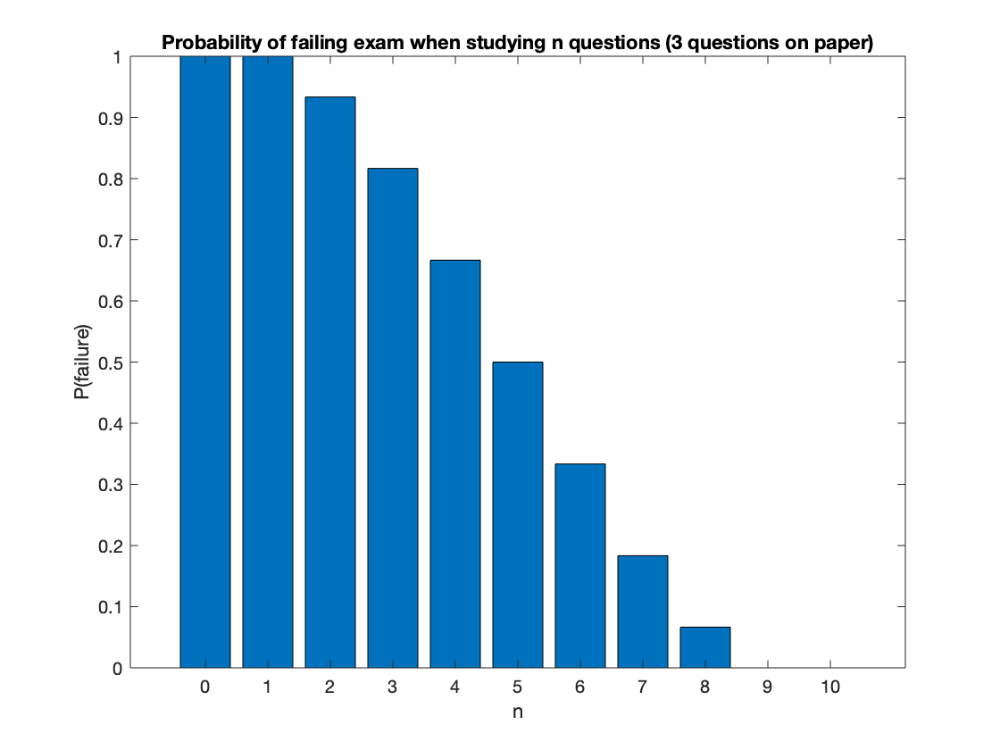
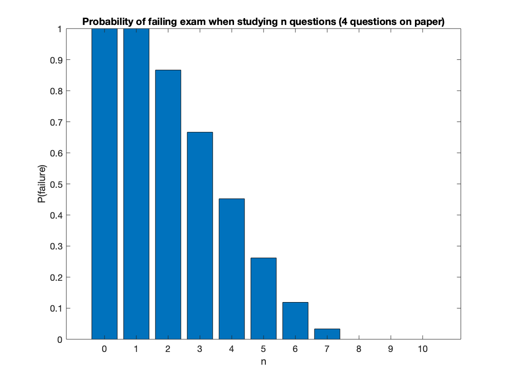
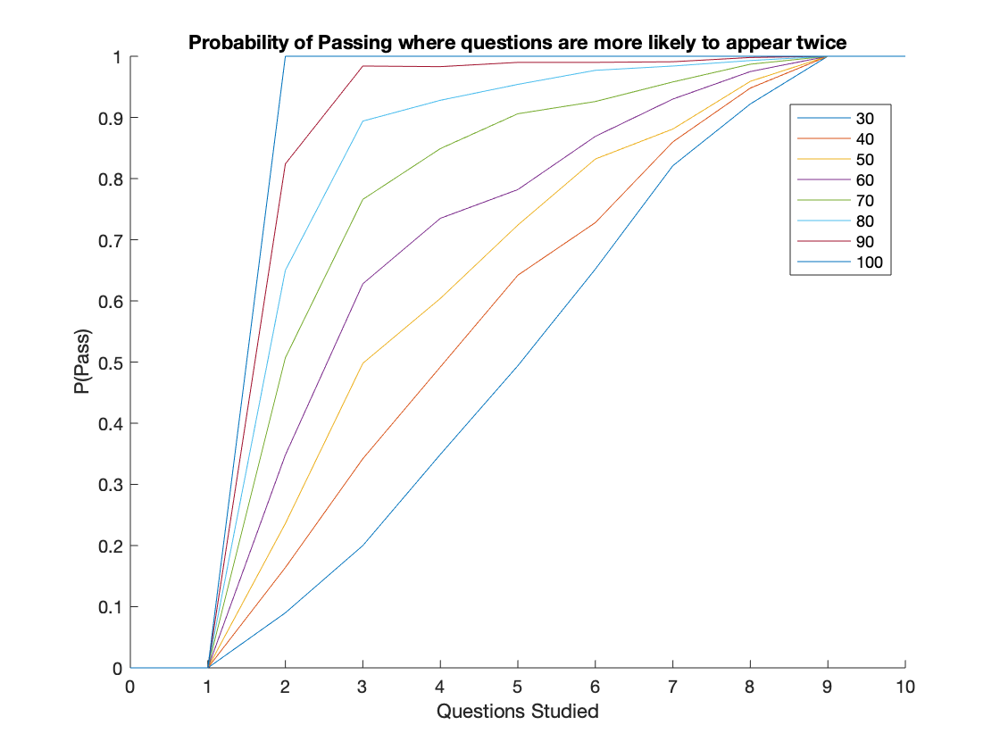

# ST3009: Statistical Methods for Computer Science

## Final Assignment - Senán d'Art - 17329580

### Q1  

#### (a)

$\binom{10}{3}=120$ possible combinations. There are 10 possible questions, we choose 3 of those 10.

#### (b)

$\frac{\binom{10-n}{3}}{\binom{10}{3}}$ where $0<=n<=7$. If $n>7$, the the probability of none of the questions studied appearing = 0  

#### (c)  

p(none)+p(exactly 1)  
p(none) = $\frac{\binom{10-n}{3}}{\binom{10}{3}}$ where $0<=n<=7$, outside of this range $P=0$  
p(exactly 1) = $\frac{\binom{n}{1}*\binom{9-n}{2}}{\binom{10}{3}}$, where $1<=n<=8$, outside of this range $P=0$  

<!--  -->

#### (d)  

p(none)+p(exactly 1)  
p(none) = $\frac{\binom{10-n}{4}}{\binom{10}{4}}$, where $0<=n<=6$, outside of this range $P=0$  
p(exactly 1) = $\frac{\binom{n}{1}*\binom{10-n}{3}}{\binom{10}{4}}$, where $1<=n<=7$, outside of this range $P=0$  

<!--  -->

**COMPARE WITH RESULTS FROM PART (C)**  
The chance of failing is much lower.  
This is due to the additional question on the exam.  
Do some maths on the percentage difference at each point.  
Still need to answer 2 questions to pass but more likely that you will have studied at least 2.  
Far less likely that will have studied none of 4 vs. none of 3.


#### (e)

The code generates 2 lists of numbers 0-10. It selects the first 3 from one and first n from the other. If there is an overlap of more than 1 ie. student passes exam, it returns 1, otherwise 0.

#### (f)

Call function from (e) N times and return the mean

Searching for range $[\mu-2\sigma, \mu+2\sigma]$
$$
\mu \plusmn 2 \frac{\sigma}{\sqrt{N}}
$$
$var(X_i)=\sigma^2$
$$
E[X_i]\plusmn2\frac{\sqrt{var(X_i)}}{\sqrt{N}}
$$
$$
E[X_i]\plusmn2\sqrt{\frac{var(X_i)}{N}}
$$

Using (c):  
$1-E[X_i]=0.1833, E[X_i]=0.8167$ when $n=7$.  
$var(X_i)=\mu*(1-\mu)=0.8167*0.1833=0.1497$


Where $N=1,000$:  
$0.8167\plusmn2\sqrt{\frac{0.1497}{1000}}$  
$0.8167\plusmn0.02447$  
$[0.79223,0.84117]$

Where $N=10,000$:  
$0.8167\plusmn2\sqrt{\frac{0.1497}{10000}}$  
$0.8167\plusmn0.00773$  
$[0.80897,0.82443]$

#### (g)  
***Change this a bit***  
The simulation generates a new set of topics studied by a student and a set of topics to appear on the exam for each N. It then verifies if the student has passed the exam and uses the series of values to calculate the mean, Y.  
For each iteration of the simulation, the resulting Y is compared to the confidence interval and if it lands within the interval it is added to a counter. When all X simulations have been run, this counter is divided by X to find what percentage was within the confidence interval.  
I chose an X of $1,000$. The reason for this is that we are already using values of $N=1,000,N=10,000$ resulting in a total number of iterations of $1,000,000$ and $10,000,000$ respectively. This number is more than large enough to provide an accurate result. Running time was also unreasonable when $X>1,000$ which did factor into the decision.  
In the case of $N=1,000$ the simulation resulted in an accuracy of $95.4\%$.  
In the case of $N=10,000$ the simulation resulted in an accuracy of $94.9\%$.  
These results seem very reasonable as both are quite close to $95\%$. With a different seed for the random number generator the result could be slightly different but both results are acceptably close to $95\%$.

#### (h)

Case A - More likely to appear after being on last exam:  
The student could modify their approach as follows:  
The first 3 topics studied will be the ones on the previous exam. After this, they will be chosen at random from all remaining topics. This approach should heavily increase the likelihood of passing depending on how predictable the exam is.  
The simulation was modified as follows:  
A 'past exam' was generated, representing the previous year's exam. Based on how predicatable this year's exam is, the questions from the previous exam were more likely to be selected this year. The student's approach to the exam was to first study the previous exam and then all other topics.  

Here the legend refers to the % probability that a question will appear on this year's exam, given that it appeared last year. The simulation was run for $N=1,000$ for all values. As can be clearly seen in this chart: a more predictable exam will result in a much higher chance of passing.
In the case of a completely random exam, each question has a $30\%$ chance of appearing on the paper. Here we can see what happens when we chance that probability from 30-100% in intervals of 10%.  


Case B - Less likely to appear after being on the last exam:  
In this case the student would take a different approach:  
The last 3 questions studied would be those in last year's exam. All others would be chosen at random.  
When running the sim, plot range of likelihoods ie. with the chance of each question appearing in the ranges of 30-0% in intervals of 5%.  
Last 3 topics studied will be the ones on the previous exam. First, randomly from all questions not on previous exam. Should also result in higher chance of passing.

Assuming exam is predictable, it is not but uses strategy anyway.  
(I presume this shouldn't make much of a difference as the chance of any question appearing is then even so the order we study them in should make no difference.)

<br><br>

### Q2  

Dataset:  `# id:0.332:0.5-0.524:2-0.308:2-0`

#### (a)  


<br><br><br><br>

### Appendix

**Section 1:** Code used to generate the plot in Q1 (c).
```matlab

```
 
<br>

**Section 2:** Code used to generate the plot in Q1 (d).
```matlab

```

<br>

**Section 3:** Code for Q1 (e).
```matlab

```

<br>

**Section 4:** Code for Q1 (f).
```matlab

```

<br>

**Section 5:** Code for Q1 (g).
```matlab

```

<br>

**Section 6:** Code for Q1 (h) A.
```matlab

```

<br>

**Section 7:** Code for Q1 (h) B.
```matlab

```
