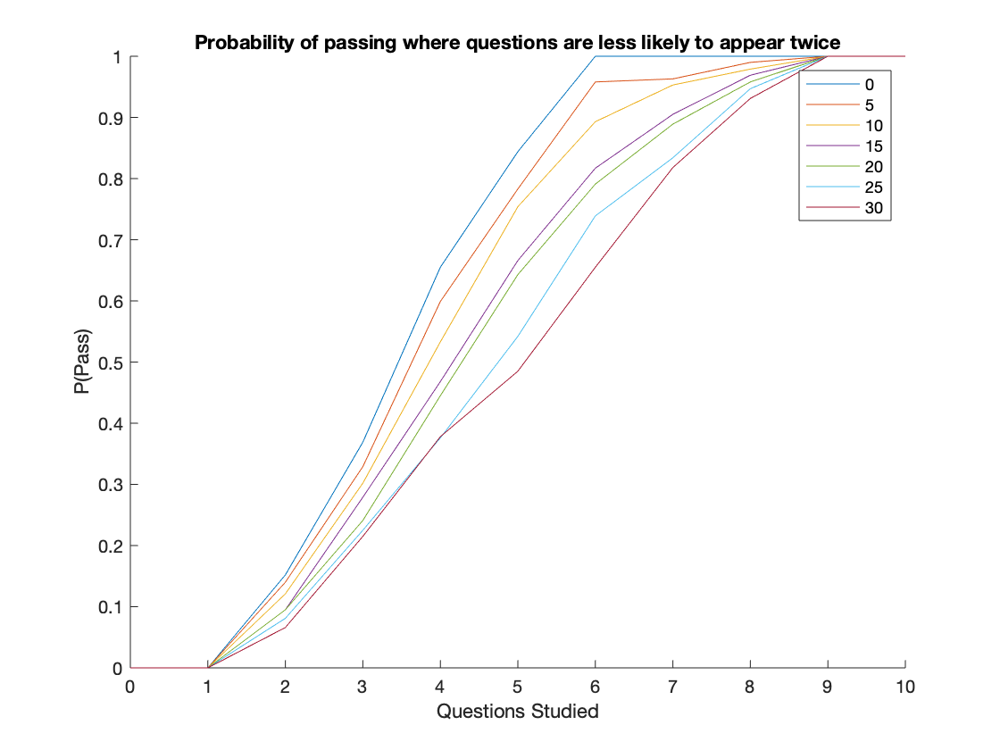

# ST3009: Statistical Methods for Computer Science

## Final Assignment - Senán d'Art - 17329580

### Q1  

**(a)** $\binom{10}{3}=120$ possible combinations. There are 10 possible questions, we choose 3 of those 10 without replacement.

**(b)** $\frac{\binom{10-n}{3}}{\binom{10}{3}}$ where $0<=n<=7$. If $n>7$, $P(none)=0$. If we assume that none of the $n$ topics we studied appear on the exam, that means the exam was a combination of all other topics ie. $10-n$. We divide this by the total possible number of exams to get the probablilty that none appear.
As there are 3 questions on the exam and the student must have not studied at least 3 topics for a full exam to include none of the topics studied.

#### (c)  

To calculate this we add $P(none)$ and $P(exactly1)$, the probabilities that either none or only one of the topics studied appears on the paper.
$P(none) = \frac{\binom{10-n}{3}}{\binom{10}{3}}$ where $0<=n<=7$, outside of this range $P=0$ as explained in $(b)$  
$P(exactly 1) = \frac{\binom{n}{1}*\binom{9-n}{2}}{\binom{10}{3}}$, where $1<=n<=8$, outside of this range $P=0$.  
To get this we get the number of exam combinations where $1$ of the $n$ topics we have studied appears and $2$ of the $9-n$ topics we haven't studied appear. To get the probability, we then divide this by the total number of possible exams. The following plot shows the probability of failing as $n$ increases.


<!--  -->

#### (d)  

Once again we add $P(none)$ and $P(exactly1)$, the probabilities that either none or only one of the topics studied appears on the paper.
In this case:
$P(none) = \frac{\binom{10-n}{4}}{\binom{10}{4}}$, where $0<=n<=6$, outside of this range $P=0$. This is similar to $(c)$: the number of 4-topic exam combinations that can be made with the $10-n$ topics that were not studied divided by the total number of exams. If $n>6$, $P(none)=0$ as each exam covers 4 topics and there are $<4$ unstudied topics.  
$P(exactly 1) = \frac{\binom{n}{1}*\binom{10-n}{3}}{\binom{10}{4}}$, where $1<=n<=7$, outside of this range $P=0$. As previously: we will only fail is $1$ or less of our studied topics appears (as 2 are required to pass). Get all combinations of only one of the studied topics appearing on the exam divided by the total number of exams.  


<!--  -->

In the case of this exam, where there are 4 topics on the paper, the probability of failing is much lower overall.  
Studying at least 8 topics will guarantee a passing grade on the latter exam, compared to the 9 required in the first exam. This is due to the same number of questions that must be answered to pass but in the case of the latter exam, there is a higher probability that the exam will contain at least 2 of the studied topics.  
Therefore if the standard of questions on both exams is equal, the 4-topic exam will have a higher pass rate.

#### (e)

The code generates 2 random lists of numbers 0-10. It selects the first 3 from one (the exam) and first $n$ from the other (the topics studied). If there is an overlap of more than 1 ie. more than 1 of the topics studied appears and student passes exam, it returns 1, otherwise 0.

#### (f)

Call function from $(e)$ N times and return the mean.
Searching for range $[\mu-2\sigma, \mu+2\sigma]$  
$\mu \plusmn 2 \frac{\sigma}{\sqrt{N}}$  
$var(X_i)=\sigma^2$  
$E[X_i]\plusmn2\frac{\sqrt{var(X_i)}}{\sqrt{N}}$  
$E[X_i]\plusmn2\sqrt{\frac{var(X_i)}{N}}$  
Using $(c)$:  
$1-E[X_i]=0.1833, E[X_i]=0.8167$ when $n=7$.  
$var(X_i)=\mu*(1-\mu)=0.8167*0.1833=0.1497$  
Where $N=1,000$:  
$0.8167\plusmn2\sqrt{\frac{0.1497}{1000}} \Rightarrow$ $0.8167\plusmn0.02447 \Rightarrow$ $[0.79223,0.84117]$  
Where $N=10,000$:  
$0.8167\plusmn2\sqrt{\frac{0.1497}{10000}} \Rightarrow$ $0.8167\plusmn0.00773 \Rightarrow$ $[0.80897,0.82443]$

#### (g)  

At every iteration of the simulation the following is done $N$ times: a new exam and a new set of studied topics is generated. After this, it is determined if the student has passes the exam ie. more than 1 of the studied topics is on the exam. It then uses this to calculate the mean $Y$.  
Each time this is done, the value of $Y$ is compared to the confidence interval and if it is within the confidence interval it is added to a tally. When the simulations have run, this number is divided by $X$ to find the percentage of results that landed within the confidence interval.
I chose the value of $X$ to be $1,000$. The reason for this is that we are already using quite large values for $N$: $N=1,000,N=10,000$ resulting in a total number of iterations of $1,000,000$ and $10,000,000$ respectively. This number is more than large enough to provide an accurate result. Running time was also unreasonable when $X>1,000$ which did factor into the decision.  
In the case of $N=1,000$ the simulation resulted in an accuracy of $95.4\%$.  
In the case of $N=10,000$ the simulation resulted in an accuracy of $94.9\%$.  
These results seem very reasonable as both are quite close to $95\%$. With a different seed for the random number generator the result could be slightly different but both results are acceptably close to $95\%$.

#### (h)

**Case A** - More likely to appear after being on last exam:  
The student could modify their approach as follows:  
The first 3 topics studied will be the ones on the previous exam. After this, they will be chosen at random from all remaining topics. This approach should heavily increase the likelihood of passing depending on how predictable the exam is.  
The simulation was modified as follows:  
A 'past exam' was generated, representing the previous year's exam. Based on how predicatable this year's exam is, the questions from the previous exam were more likely to be selected this year. The student's approach to the exam was to first study the previous exam and then all other topics.  


<!--  -->

Here the legend refers to the % probability that a question will appear on this year's exam, given that it appeared last year. The simulation was run for $N=1,000$ for all values. As can be clearly seen in this chart: a more predictable exam will result in a much higher chance of passing.
In the case of a completely random exam, each question has a $1/10+1/9+1/8 = 33.6\%$ chance of appearing on the paper. Here we can see what happens when we chance that probability from 30-100% in intervals of 10%.  

**Case B** - Less likely to appear after being on the last exam:  
In this case the student would take a different approach:  
The last 3 questions studied would be those in last year's exam. All others would be chosen at random.  
The code for this operates in a similar manner to Case A where percentages go from $0\rightarrow30\%$ in intervals of $5\%$.



<!--  -->
Again the legend refers to the probability (in %) that a question will appear on this year's exam, given that it was on last year's exam.
In this case, the chance of passing was not increased as drastically as in the previous case where a question is more likely to appear 2 exams in a row. It does reduce the number of topics required to be studied from 9 to 6 if the exam is perfectly predictable and the student wants to guarantee that they will pass.

**Case C** - The exam is not predictable but the student assumes it is:  
Here we apply all 3 strategies of studying: random selection, prioritising questions that **were** on last year's exam, prioritising questions that **were not** on last year's exam. The results should be the same for all 3 as all questions have the same probability of appearing but we will run the simulation anyway.


<!--    -->
Here the legend refers to the student's approach when studying topics. As can be seen in the graph, there is no advantage to any of the study methods when the exam is randomised. While the results are not exactly the same, they are close enough to be considered equal for the sample size. This also means that there is no disadvantage to the student for assuming the exam is predictable, when it is not.


### Q2  

Dataset:  `# id:0.332:0.5-0.524:2-0.308:2-0`

#### (a)  


<!--  -->
<!--  -->
<!--  -->

When comparing each of these questions, we can see a clear trend with each question. In the case of the first question, a large number of students got full marks. There is also a cluster at each end with students trending towards doing very well or very poorly. This distribution of marks could hint at a question that was not inherently difficult but may have been a niche topic to study. A question with a specific answer that wasn't difficult if studied but hard to guess (hence the lack of scores around 50%).  
The second question has a more central distribution with few students failing (<40%) but none doing exceptionally well. Most scores are clustered around the 50% mark. This seems to show that it was relatively easy to pass but very hard to do well. It also implies that most students were prepared for this question.
Question 3 seems to have been a reasonable question. Most students passed with a mark of ~50% but the results also tailed upwards implying that it allowed students who worked hard or were very well prepared to perform to a higher standard. Therefore I would assume it is a well balanced question that was not very hard to achieve a passing grade in while also allowing students to distinguish themselves.
This approach to evaluating the difficulty of questions has several advantages and disadvantages. Advantages include that it is very quick and easy to view the information as all it requires is plotting the results, it also provides information on the distribution of results.  
However it doesn't show information about how individual students performed across the exams ie a student could do very well in one exam but poorly in another and this type on analysis would not show that.

#### (b)  

The following two graphs illustrate the conditioned mean and variance for Q2 & Q3 based on results in Q1. This was achieved by grouping each of the students based on their score in Q1 and and then plotting both their mark for Q2 & Q3 as well as the variance at each (calculated using the matlab $var$ function).


<!--  -->


<!--  -->

Here the mean follows a general upward trend, where students who performed well in the first question generally also did well in the subsequent 2. However the variance is very high.  
I did not use binning to group the data. In this case all scores are in groups of $5\%$ however they are not binned as all results in the dataset were multiples of $5\%$. It could be useful to bin the results in batches of $10\%$ as these are generally what grade lines are based on eg. the difference between a 2nd and a 1st is $10\%+$, more granular measurements of grades are not pertinent to the final grade.  
In the case of real-world data where results are not multiples of $5\%$, binning would be important, as it would mostly likely be a waste of time to compare exact scores, in this case I would again use bins of $5\%$.

#### (c)

I used CLT to determine the mean conditioned mark with a 95% confidence interval. To do this we take the previous values for the mean and applying the following formulas using the calculated variance: $\sigma = \sqrt{variance}$, $\mu \plusmn 1.96 * \frac{\sigma}{\sqrt{N}}$. The resulting interval was then added to the mean mark as error bars (something that matlab doesn't natively support for grouped bar charts so they had to be placed manually).


<!--  -->

From these results we can determine several things:  
Q3 was an easier question overall with results generally trending to be higher and fewer students failing the exam. There was generally a margin of $5-10\%$ between the conditioned mark for Q2 & Q3 ie. the score for Q3 was generally that much higher.  
The pass rate for Q3 was higher, especially among students that failed Q1.  
This data also shows that Q1 was dramatically harder than the other questions even students that got extremely low scores in Q1 still either passed or almost passed Q2 & Q3.  


#### (d)

In this case we would be using linear regression to find a least-squares fit.  
Plot the data of $Score(Q1)$ vs $Score(Q2)$. Draw a line through the data that seems reasonable. Rate the accuracy by tallying the total value given by getting the distance from each point to the line and squaring it.  
Adjust the line and repeat.
Repeat this until an optimal solution is reached (the lowest resulting value).  
This approach is not ideally suited to this kind of prediction as the relationship in between the results is not linear. It might provide more accurate results by considering other factors such as the distribution of the results for each question when defining the model.  
In the case of linear regression, we expect the output to be a gaussian random variable ie. normally distributed about a mean with a variance of 1. In this case however the variance is much higher than this and unsuitable for this kind of analysis.

#### (e)  

$X_{ij}=S_i-D_j$  
If we take at $i$ and $j$: $P(S=s^{(i)}|\theta, x^{(i)} = \frac{1}{1+e^{-s^{(i)}\theta^Tx^{(i)}}}$  
Since $S$ and $D$ are Gaussian random variables we can do the following: PDF of $S$ given that it has a mean $\theta ^Tx$ and variance 1 $\Rightarrow$ $f_S(s)=\frac{1}{\sqrt{2\pi}}e^{-\frac{(s-\theta^Tx)^2}{2}}$. Similarly for $D$ where mean is $\theta_1 ^{T_1}x_1 \Rightarrow f_D(d)=\frac{1}{\sqrt{2\pi}}e^{-\frac{(d-\theta_1^{T_1}x_1)^2}{2}}$. The result for $X$ is $\frac{1}{\sqrt{2\pi}}e^{-\frac{(s-\theta^Tx)^2}{2}}-\frac{1}{\sqrt{2\pi}}e^{-\frac{(d-\theta_1^{T_1}x_1)^2}{2}}$. When we then move to the log likelihoods assuming training data $d \Rightarrow f_{(D|\theta)}(d|\theta) =\begin{aligned} \prod^{m}_{i=1}\end{aligned}\frac{1}{\sqrt{2\pi}}e^{-\frac{(s^{(i)}-h_\theta(x^{(i)})^2}{2}}-\begin{aligned} \prod^{m}_{j=1}\end{aligned}\frac{1}{\sqrt{2\pi}}e^{-\frac{(D^{(j)}-h_\theta(x^{(j)})^2}{2}} \Rightarrow -log(\frac{1}{\sqrt{2\pi}^m})\sum^{m}_{i=1}\frac{(s^{(i)}-h_\theta (x^{(i)})^2)}{2}+log(\frac{1}{\sqrt{2\pi}^m})\sum^{m}_{j=1}\frac{(d^{(j)}-h_\theta (x^{(j)})^2)}{2}$


#### (f)

1. Pick a random value for $S_i$ and $D_j$.  
2. Test these values in the expression we have for $X_{ij}$.  
3. Test for each variable $S_i$ and $D_j$, test values that are higher and lower by some amount $x$. This will allow us to determine the slope and what our next estimate for our varaibles should be.  
4. Choose the values for $S_i$ and $D_j$ that result in the best $X_{ij}$ and repeat steps 2-4 until a desired accuracy is reached.

The value of $x$ must be carefully chosen as a value too small will take a long time to reach an optimal answer and a value that is too large may miss the optimal answer completely.  
It is possible to modify $x$ so that it is initially large but reduces when the the function starts reducing accuracy. This would allow for faster progress during initial iterations while also allowing for increased accuracy in later iterations.

<p style="page-break-before: always">

### **Appendix**

**Section 1:** Code for Q1 (c).
```matlab
rng(221);
arr = zeros(1,11);
idx = [0:10];

for n = 1:11
    arr(n) = exactNone(n-1)+exactOne(n-1);
end
bar(idx, arr)
title("Probability of failing exam when studying n questions (3 questions on paper)")
xlabel("n")
ylabel("P(failure)")

%returns probability that none of the studied topics appear
function X = exactNone (n)
    if n<=7
        X = nchoosek(10-n,3)/nchoosek(10,3);
    else
        X = 0;
    end
end

%returns probability that exactly one of the studied topics appears
function X = exactOne (n)
    if n <= 8 & n >=1
        X = (nchoosek(n,1)*nchoosek(10-n,2))/nchoosek(10,3);
    else
        X = 0;
    end
end
```
 
<br>

**Section 2:** Code for Q1 (d).
```matlab
rng(221);
arr = zeros(1,11);
idx = [0:10];

for n = 1:11
    arr(n) = exactNone(n-1)+exactOne(n-1);
end
bar(idx, arr)
title("Probability of failing exam when studying n questions (4 questions on paper)")
xlabel("n")
ylabel("P(failure)")

%returns probability that none of the studied topics appear
function X = exactNone (n)
    if n<=6
        X = nchoosek(10-n,4)/nchoosek(10,4);
    else
        X = 0;
    end
end

%returns probability that exactly one of the studied topics appears
function X = exactOne (n)
    if n <= 7 & n >=1
        X = (nchoosek(n,1)*nchoosek(10-n,3))/nchoosek(10,4);
    else
        X = 0;
    end
end
```

<br>

**Section 3:** Code for Q1 (e).
```matlab
rng(221);
stoSim3(1)
function X = stoSim3 (n)
    choice = randperm(10); %get elements in random order
    choice = choice(1:3); %select 3 questions for exam
    studied = randperm(10); %random order of studied qs
    studied = studied(1:n); %n number of studied qs
    overlap = setdiff(choice, studied); %studied vs exam
    if numel(overlap) < 2 %if at least 2 studied appear
        X = 1;
    else
        X = 0;
    end
end
```

<br>

**Section 4:** Code for Q1 (f).
```matlab
rng(221);
extSim(1000)
function X = stoSim3 (n)
    choice = randperm(10); %get elements in random order
    choice = choice(1:3); %select 3 questions for exam
    studied = randperm(10); %random order of studied qs
    studied = studied(1:n); %n number of studied qs
    overlap = setdiff(choice, studied); %studied vs exam
    if numel(overlap) < 2 %if at least 2 studied appear
        X = 1;
    else
        X = 0;
    end
end

function Y = extSim(N)
    generated = randi(11,[1,N])-1;
    Y = 0;
    for i = 1:numel(generated)
        Y = Y + stoSim3(7);
    end
    Y = Y/N;
end
```

<br>

**Section 5:** Code for Q1 (g).
```matlab
rng(221);
%N = 1000; %a
N = 10000; %b
runs = 1000;
freq = zeros([1,runs]);
%lowerBound = 0.79223; %a
%upperBound = 0.84117; %a
lowerBound = 0.80897; %b
upperBound = 0.82443; %b
perBound = 0;

for i = 1:runs
    freq(i) = extSim(N);
    if freq(i) > lowerBound & freq(i) < upperBound
       perBound = perBound + 1; 
    end
end
perBound = perBound/runs
hist(freq)


function X = stoSim3 (n)
    choice = randperm(10); %get elements in random order
    choice = choice(1:3); %select 3 questions for exam
    studied = randperm(10); %random order of studied qs
    studied = studied(1:n); %n number of studied qs
    overlap = setdiff(choice, studied); %studied vs exam
    if numel(overlap) < 2 %if at least 2 studied appear
        X = 1;
    else
        X = 0;
    end
end

function Y = extSim(N)
    generated = randi(11,[1,N])-1;
    Y = 0;
    for i = 1:numel(generated)
        Y = Y + stoSim3(7);
    end
    Y = Y/N;
end
```

<br>

**Section 6:** Code for Q1 (h) A.
```matlab
rng(221);
low = 0.30;
high = 1;
steps = 0.1;
runs = 1000;
resMat = zeros(10, cast((high-low)/steps,'uint8'));
legArr = zeros(1, cast((high-low)/steps,'uint8'));

for i = 0:((high-low)/steps)+1
   legArr(i+1) = cast((low+i*steps)*100,'uint8');
end    
legArr = string(legArr);


for i = 0:10
    step = 1;
   while step < ((high-low)/steps)+2
       pred = low + ((step-1)*steps);
       xSum = 0;
       for j = 1:runs
           xSum = xSum + stoSim3(i, pred);
       end
       resMat(i+1, step) = xSum/runs;
       step = step + 1; 
   end
end
idx = [0:10];
% bar(idx,resMat)
line(idx, resMat)
legend(legArr)
xlabel("Questions Studied")
ylabel("P(Pass)")
title("Probability of Passing where questions are more likely to appear twice")


function X = stoSim3 (n, predictability)
    oldpaper = randperm(10); %get elements in random order
    newpaper = zeros(1,3);
    newIndex = 1;
    for i = 1:3 %pull answers from old paper with some probability
       x = rand;
       if(x < predictability)
           newpaper(newIndex) = oldpaper(i);
       else
           newpaper(newIndex) = oldpaper(i+3);
       end
       newIndex = newIndex + 1;
    end
    studied = randperm(10); %random order of studied qs
    for i = 1:3 %reorder studied qs so that previous exam qs are first
        swpIndex = find(studied == oldpaper(i));
        studied([i swpIndex]) = studied([swpIndex i]);
    end
    studied = studied(1:n); %n number of studied qs
    overlap = setdiff(newpaper, studied); %studied vs exam
    if numel(overlap) < 2 %if at least 2 studied appear
        X = 1; %pass
    else
        X = 0; %fail
    end
end
```

<br>

**Section 7:** Code for Q1 (h) B.
```matlab
rng(221);
low = 0.0;
high = 0.3;
steps = 0.05;
runs = 1000;
resMat = zeros(10, cast((high-low)/steps,'uint8'));
legArr = zeros(1, cast((high-low)/steps,'uint8'));

for i = 0:((high-low)/steps)+1
   legArr(i+1) = cast((low+i*steps)*100,'uint8');
end    
legArr = string(legArr);


for i = 0:10
    step = 1;
   while step < ((high-low)/steps)+2
       pred = low + ((step-1)*steps);
       xSum = 0;
       for j = 1:runs
           xSum = xSum + stoSim3(i, pred);
       end
       resMat(i+1, step) = xSum/runs;
       step = step + 1; 
   end
end
idx = [0:10];
% bar(idx,resMat)
line(idx, resMat)
legend(legArr)
xlabel("Questions Studied")
ylabel("P(Pass)")
title("Probability of passing where questions are less likely to appear twice")


function X = stoSim3 (n, predictability)
    oldpaper = randperm(10); %get elements in random order
    newpaper = zeros(1,3);
    newIndex = 1;
    for i = 1:3 %pull answers from old paper with some probability
       x = rand;
       if(x < predictability)
           newpaper(newIndex) = oldpaper(i);
       else
           newpaper(newIndex) = oldpaper(i+3);
       end
       newIndex = newIndex + 1;
    end
    studied = randperm(10); %random order of studied qs
    for i = 1:3 %reorder studied qs so that previous exam qs are last
        swpIndex = find(studied == oldpaper(i));
        studied([end-i swpIndex]) = studied([swpIndex end-i]);
    end
    studied = studied(1:n); %n number of studied qs
    overlap = setdiff(newpaper, studied); %studied vs exam
    if numel(overlap) < 2 %if at least 2 studied appear
        X = 1; %pass
    else
        X = 0; %fail
    end
end
```

<br>

**Section 8:** Code for Q1 (h) C.
```matlab
rng(221);
low = 0.3;
high = 0.3;
steps = 0.05;
runs = 1000;
resMat = zeros(10, 3);
legArr = [{'random'}, {'in-last'}, {'not-in-last'}];


for i = 0:10
    step = 1;
   while step < ((high-low)/steps)+2
       pred = low + ((step-1)*steps);
       xSum = 0;
       for j = 1:runs
           xSum = xSum + stoSim3(i, pred);
       end
       resMat(i+1, 1) = xSum(1)/runs;
       resMat(i+1, 2) = xSum(2)/runs;
       resMat(i+1, 3) = xSum(3)/runs;
       step = step + 1; 
   end
end
idx = [0:10];
% bar(idx,resMat)
line(idx, resMat)
legend(legArr)
xlabel("Questions Studied")
ylabel("P(Pass)")
title("Probability of passing random exam when applying different strategies")


function X = stoSim3 (n, predictability)
    oldpaper = randperm(10); %get elements in random order
    newpaper = zeros(1,3);
    newIndex = 1;
    for i = 1:3 %pull answers from old paper with some probability
       x = rand;
       if(x < predictability)
           newpaper(newIndex) = oldpaper(i);
       else
           newpaper(newIndex) = oldpaper(i+3);
       end
       newIndex = newIndex + 1;
    end
    studied = randperm(10); %random order of studied qs
    studiedRnd = studied(1:n);
    for i = 1:3 %reorder studied qs so that previous exam qs are last
        swpIndex = find(studied == oldpaper(i));
        studied([end-i swpIndex]) = studied([swpIndex end-i]);
    end
    studiedA = studied(1:n); %n number of studied qs
    studiedB = studied(end-n+1:end);
    
    X = [numel(setdiff(newpaper, studiedRnd)) < 2
        numel(setdiff(newpaper, studiedA)) < 2
        numel(setdiff(newpaper, studiedB)) < 2];
end
```

<br>

**Section 9:** Code for Q2 (a).
```matlab
A = readmatrix('dataset_answers', 'Delimiter', ' ');
Q1 = A(:, 1);
Q2 = A(:, 2);
Q3 = A(:, 3);

histogram(Q1, numel(unique(Q1)),'Normalization','probability')
title('Question 1')
xlabel('Grade')
ylabel('P(Grade)=X')

histogram(Q2, numel(unique(Q2)),'Normalization','probability')
title('Question 2')
xlabel('Grade')
ylabel('P(Grade)=X')

histogram(Q3, numel(unique(Q3)),'Normalization','probability')
title('Question 3')
xlabel('Grade')
ylabel('P(Grade)=X')

```

<br>

**Section 10:** Code for Q2 (b).
```matlab
A = readmatrix('dataset_answers', 'Delimiter', ' ');
A = sortrows(A, 1);
resArr = zeros(2,21);
szA = size(A);
cQ = zeros(2,21);
varQ= zeros(2,21);
idx = [0:5:100]

pre2 = 0;
pre3 = 0;
preIdx2 = 1;
preIdx3 = 1;
for i = 1:szA(1)
    if A(i, 1) ~= pre2
       varQ(1, floor(A(i,1)/5)) = var(A(preIdx2:i-1,2));
       preIdx2 = i;
       pre2 = A(i, 1);
    end
    if A(i, 1) ~= pre3
       varQ(2, floor(A(i,1)/5)) = var(A(preIdx3:i-1,3));
       preIdx3 = i;
       pre3 = A(i, 1);
    end
end
varQ(1, 21) = var(A(preIdx2:szA(1),2));
varQ(2, 21) = var(A(preIdx3:szA(1),3));

for i = 1:szA(1)
    resArr(1,floor(A(i,1)/5)+1) = resArr(1,floor(A(i,1)/5)+1) + A(i,2);
    resArr(2,floor(A(i,1)/5)+1) = resArr(2,floor(A(i,1)/5)+1) + A(i,3);
    cQ(1, floor(A(i,1)/5)+1) = cQ(1, floor(A(i,1)/5)+1) + 1;
    cQ(2, floor(A(i,1)/5)+1) = cQ(2, floor(A(i,1)/5)+1) + 1;
end
resArr

bar(idx,(resArr ./ cQ)')
legend('Question 2','Question 3')
xlabel('Score in Q1')
ylabel('Score in Q2/Q3')
title('Mean Conditioned Mark')

bar(idx, varQ')
legend('Question 2','Question 3')
xlabel('Score in Q1')
ylabel('Variance of conditioned mean')
title('Variance of Mean')
```

<br>

**Section 11:** Code for Q2 (c).
```matlab
A = readmatrix('dataset_answers', 'Delimiter', ' ');
A = sortrows(A, 1);
resArr = zeros(2,21);
szA = size(A);
cQ = zeros(2,21);
varQ= zeros(2,21);
idx = 0:5:100;

pre2 = 0;
pre3 = 0;
preIdx2 = 1;
preIdx3 = 1;
for i = 1:szA(1)
    if A(i, 1) ~= pre2
       varQ(1, floor(A(i,1)/5)) = var(A(preIdx2:i-1,2));
       preIdx2 = i;
       pre2 = A(i, 1);
    end
    if A(i, 1) ~= pre3
       varQ(2, floor(A(i,1)/5)) = var(A(preIdx3:i-1,3));
       preIdx3 = i;
       pre3 = A(i, 1);
    end
end
varQ(1, 21) = var(A(preIdx2:szA(1),2));
varQ(2, 21) = var(A(preIdx3:szA(1),3));

for i = 1:szA(1)
    resArr(1,floor(A(i,1)/5)+1) = resArr(1,floor(A(i,1)/5)+1) + A(i,2);
    resArr(2,floor(A(i,1)/5)+1) = resArr(2,floor(A(i,1)/5)+1) + A(i,3);
    cQ(1, floor(A(i,1)/5)+1) = cQ(1, floor(A(i,1)/5)+1) + 1;
    cQ(2, floor(A(i,1)/5)+1) = cQ(2, floor(A(i,1)/5)+1) + 1;
end

err = zeros(2,21);

szRes = size(resArr);
for i = 1:szRes(2)
    err(1,i) = (1.96) * (sqrt(varQ(1,i))/ sqrt(cQ(1,i)));
    err(2,i) = (1.96) * (sqrt(varQ(2,i))/ sqrt(cQ(2,i)));
end
model_series = (resArr ./ cQ)';
model_error = err';
bar(idx,model_series, 'grouped');
hold on %manually calculate error bar positions
ngroups = size(model_series, 1);
nbars = size(model_series, 2);
groupwidth = min(0.8, nbars/(nbars + 1.5));
for i = 1:nbars
    x = (((1:ngroups) - groupwidth/2 + (2*i-1) * groupwidth / (2*nbars))*5)-5;
    errorbar(x, model_series(:,i), model_error(:,i), 'k', 'linestyle', 'none');
end

legend('Question 2','Question 3')
xlabel('Score in Q1')
ylabel('Score in Q2/Q3')
title('Mean Conditioned Mark w/ 95% Confidence Intervals')
```
