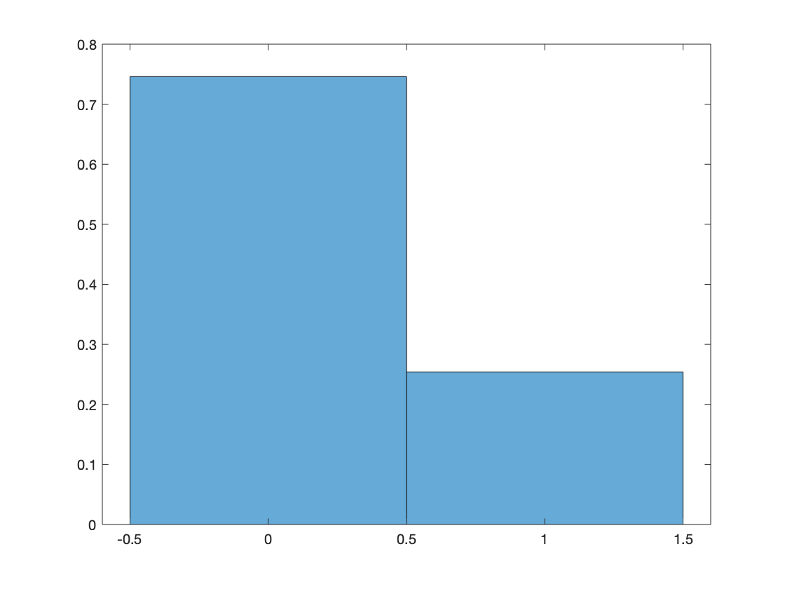

# ST3009: Statistical Methods for Computer Science

## MidTerm Assignment - Senán d'Art - 17329580

### Q1  

#### (a)  

#### (b)  

$Prob(X_0 = 1)=0.2540$  

#### (c)  

Chebyshev:  
$$
0.1924 \leq X \leq 0.3156
$$

CLT:
$$
0.2270 \leq X \leq 0.2810
$$

Bootstrapping:  
$$
0.2244 \leq X \leq 0.2790
$$

CLT Pros:

- Only requires mean and variance to fully describe this distribution

CLT Cons:

- Only provides an approximation (not an actual bound)

Chebyshev Pros:

- Provide an actual bound (not an approximation)

Chebyshev Cons:  

Bootstrapping Pros:  

Bootstrapping Cons:  

- hard to be sure how accurate the results are

  

### Q2

$Prob(X_0 = 1)=0.2540$  
$Prob(X_1 = 1)=0.3460$  
$Prob(X_2 = 1)=0.2980$  
$Prob(X_3 = 1)=0.3800$  
$Prob(X_4 = 1)=0.2250$  
$Prob(X_5 = 1)=0.2820$  
$Prob(X_6 = 1)=0.3170$  

  

### Q3  

Multiplying each probability by likelihood of access:  
0.0608    0.0067    0.0693    0.0636    0.0253    0.0550    0.0107  

Total:  
0.2915

  

### Q4 

Probability that the user number is 0 given that the request time is over 10ms.  

$P(User_0) = 0.23926015099014$  
$P(Z_n > 10) = 0.2915$  
$P(Z_n > 10|User_0)= 0.2540$

$$
P(User_0 | Z_n > 10) = \frac{P(Z_n > 10|User_0)P(User_0)}{P(Z_n > 10)}
$$

$$
P(User_0 | Z_n > 10) = \frac{(0.2540)(0.23926015099014)}{(0.2915)}
$$

$$
P(User_0 | Z_n > 10) = 0.2084805432
$$

  

### Q5  
