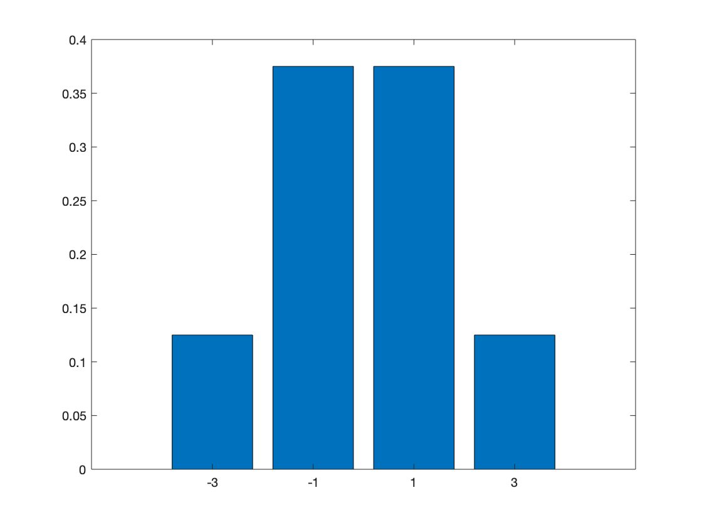
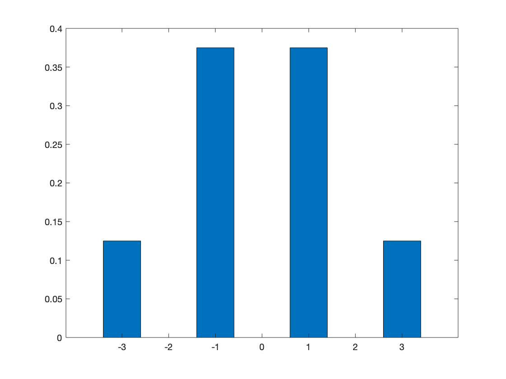
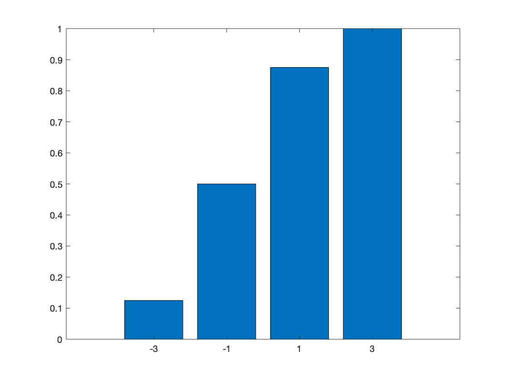
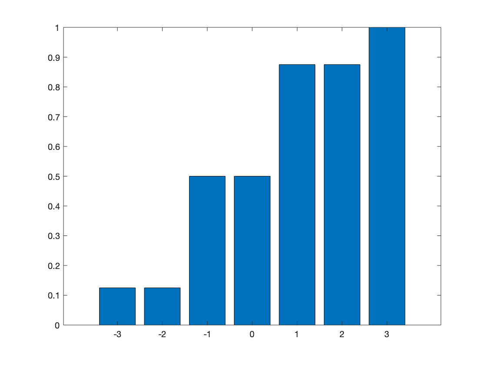
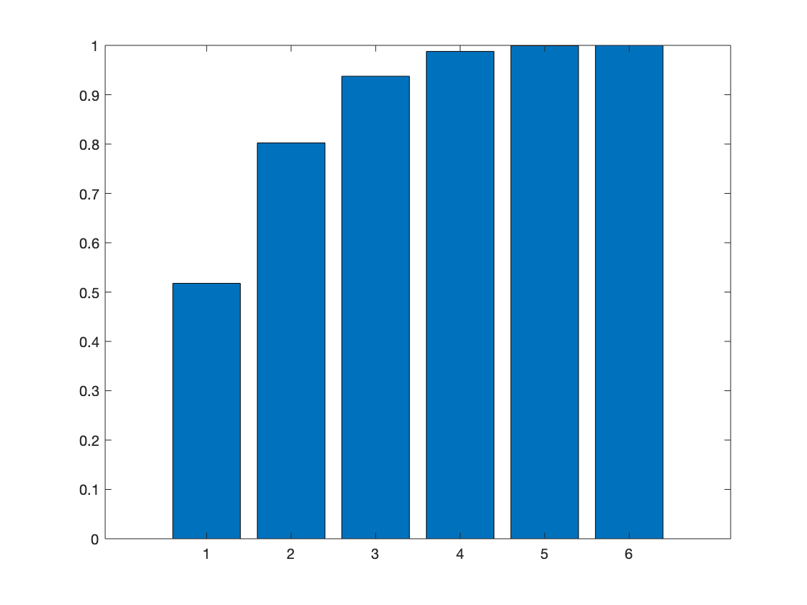

# ST3009: Statistical Methods for Computer Science

## Week 3 Assignment - Senán d'Art - 17329580

### Question 1

#### (a)

The event $(1,1)$ is the only one that corresponds to $Y=2$.  
 

#### (b)

$\{(1,2) , (2,1)\}$ correspond to $Y=3$  
 

#### (c)  

$\{(1,3),(2,2), (3,1)\}$ correspond to $Y=4$  
 

#### (d)  

Number of total possible results: $36$  
Set size: $3$  
Probability of event: $\frac{3}{36} = \frac{1}{12}$  
  

### Question 2

$X = Head - Tails$

#### (a)

Possible values of X: $\{-3, -1, 1, 3 \}$  
 

#### (b)

8 Total Combinations ($2^3$)  
Only one way to roll $-3$ : $\{ Tails, Tails, Tails \}$  
Probability: $\frac{1}{8}$
 

#### (c)

8 Total Combinations  
Three ways to roll $-1$ : $\{ [H,T,T], [T,H,T], [T,T,H] \}$  
Probability: $\frac{3}{8}$
 

#### (d)

<!--   
**PMF of X**   -->

  
**PMF of X**  

<!--   
**CDF of X** -->

  
**CDF of X**

### Question 3

#### (a)

Possible values for X are {1,2,3,4,5,6}.  
X will always be >= 1.  
Probability is $1$.  

#### (b)

For $X>=2$, no ones must be rolled.  
$$
\frac{5}{6}*\frac{5}{6}*\frac{5}{6}*\frac{5}{6} = 0.4823
$$

#### (c)
$$
X >= 1, K = 1
$$
$$
X >= 2, K = 0.4823
$$
$$
X >= 3, K = 0.1975
$$
$$
X >= 4, K = 0.0625
$$
$$
X >= 5, K = 0.0123
$$
$$
X >= 6, K = 0.0008
$$
  
**CDF of X**
