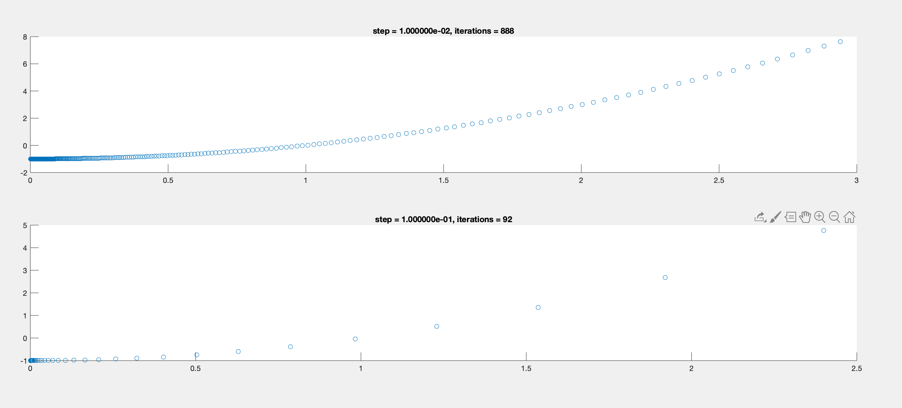
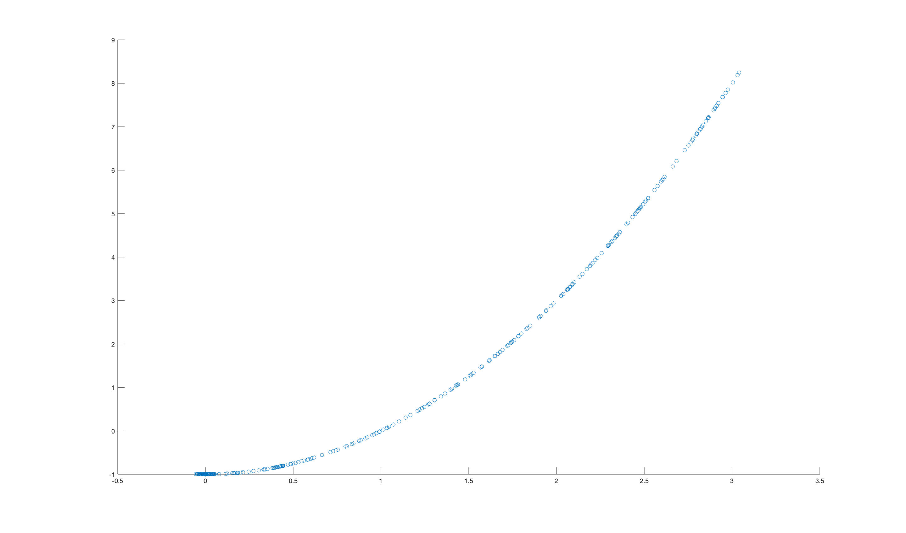

# ST3009: Statistical Methods for Computer Science

## Week 9 Assignment - Senán d'Art - 17329580

### Q1  

#### (a)  
The following function returns the minimum of the function for a given step ($\alpha$) value.
```matlab
function min = q1_a(step)
    accuracy = 0.000000001;

    i = 0;
    j = 0;
    nx = 3;
    while abs(nx - j) > accuracy
        j = nx;
        nx = j - (step * (2*j));
        i = i + 1;
    end
    min = j^2 - 1;
    disp(i);
end
```

<br>

#### (b)  
By plotting the value at each of the steps the following graphs were created:



When $\alpha = 0.01$, the minimum is acheived in 888 steps.  
When $\alpha = 0.1$, the minimum is acheived in 92 steps.   
When $\alpha = 1$, the minimum is overshot and the code will not reach it as the steps are too large.  

Out of the 3 values here, $\alpha = 0.1$ is the most optimal as it reaches the minimum without the large overhead of the smaller number. The largest value ($\alpha = 1$) is useless as it does not reach the minimum.

<br>

#### (c)  

The following code was used:  
```matlab
function m = q1c()
    step = 0.1;
    accuracy = 0.00001;
    
    rng(0);

    ix = [];
    iy = [];
    i = 0;
    x = 0;
    nx = 3;
    while abs(nx - x) > accuracy
        x = nx;

        y = f(x);
        ny = y;
        while ny >= y
            nx = x + ((rand() - 0.5) * step);
            ny = f(nx);
            i = i + 1;
            ix(i) = nx;
            iy(i) = ny;
        end
    end
    m = f(x);

    disp(i);
    scatter(ix, iy)
end

function y = f(x)
    y = x^2 - 1;
end
```

The resulting graph looked like this:  


<br><br>


#### (d)  
By changing the random seed value at the start, different timing was observed. In the case of the graph above, it took ~16,000 iterations to reach the minimum. However the number of iterations varied between $33$ (lowest observed) and  $~52,000$ (highest observed). This highlights some of the charactaristics of this approach: it is very random and the time taken to complete the operation depends heavily on the initial random seed. It is also difficult to predict the performance as it can vary greatly.

<br><br>

### Q2

#### (a)  
We can assign a value to each review, in this case we assign the value of 1 to a positive review and a value of -1 to a negative review.

Each review can be written as a vector:  

$$
pred = sign(\theta_0 + \theta_1x_1 + \theta_2x_2 + ... + + \theta_nx_n)
$$

Where $\theta_n$ is the weight applied to each element, 
$x_n$ is the number of times a word appears in the review.  
In this case $pred$ is the prediction (positive or negative).

To calculate $\theta_n$ we need to apply a cost function and iterate through possible values to find the values which are most accurate (train the model).  

When trained, we can apply the vector representing a review to the weighted vector we are using. Then based on if the result is positive or negative, we can predict the sentiment of the review. 

<br> 

#### (b)
Assumptions:  

- We assume that the relationship is linear, ie. there do not exist multiple minimums in our cost function which could result in a different result (we could find a local minimum but not a global minimum).  
- We also assume that the set of reviews selected is representative of all reviews. If there are biases in the sample data, these will be reflected in the predictions.

<br>

#### (c)  

- Take subsets of the training data (with replacement).  
- Train model using this data.  
- Log the parameter values ($\theta$).  
- Repeat many times.  

This should allow us to get a confidence interval for each of the words in the review. It must be repeated many times in order to build up a decently accurate spread of values.  
By comparing the confidence of each of the words in a review and their weights, we can predict a certain level of confidence for that review.
